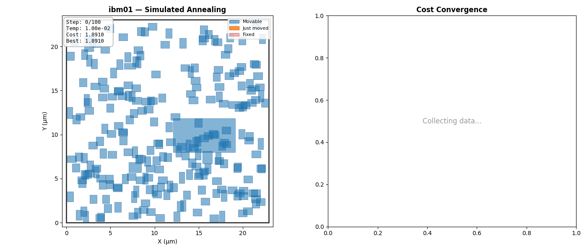

# Partcl/HRT Macro Placement Challenge

 &nbsp;&nbsp;&nbsp;&nbsp;&nbsp;&nbsp; 

**Win $20,000 by developing better macro placement algorithms!**

Partcl and Hudson River Trading are excited to co-host a competition to solve the macro placement problem. 

## About Macro Placement

Macro placement is the problem of positioning large fixed-size blocks (SRAMs, IPs, analog macros, etc.) on a chip floorplan so that routing congestion, timing, power delivery, and area constraints are balanced. Unlike standard-cell placement, macros have strong geometric and connectivity constraints, so the challenge is to explore a highly discrete design space while minimizing wirelength, avoiding blockages, and preserving downstream routability and timing quality.

For example, the **ibm01** benchmark has:
- **246 hard macros** of varying sizes (ranging from 0.8 to 27 μm², with 33× size variation)
- **7,269 nets** connecting macros to each other and to 894 pre-placed standard cell clusters
- **A 22.9 × 23.0 μm canvas** with 42.8% area utilization

<p align="center">
  <br>
  
</p>

## About HRT Hardware

Hudson River Trading (HRT) is a leading quantitative trading firm at the forefront of technical innovation in global financial markets.

HRT’s Hardware team builds the high-performance compute systems at the core of our trading infrastructure. We use FPGAs and ASICs to drive low-latency decision-making and power custom solutions across the trading stack, from bespoke circuits to machine learning accelerators.

We’re proud to sponsor this competition because advancing macro placement and low-level hardware optimization directly aligns with the kinds of hard, performance-critical engineering challenges our teams tackle every day.

Joining Hudson River Trading’s hardware team means working alongside leading engineers in one of the most advanced computing environments in global finance. Learn more about open roles at [hudsonrivertrading.com](https://www.hudsonrivertrading.com/).

## About Partcl

Partcl is rebuilding chip design infrastructure from the ground up for the GPU era.

Modern chip design is slow, fragmented, and fundamentally constrained by tools built decades ago. Critical workflows like timing analysis and placement still take hours to days - limiting how much engineers can explore and optimize.

We’re changing that.

Partcl develops GPU-accelerated systems for physical design that run orders of magnitude faster than legacy tools. Our goal is simple: make iteration cheap enough that design space exploration becomes the default, not the exception.

## Background Papers
[1] [An Updated Assessment of Reinforcement Learning for Macro Placement](https://ieeexplore.ieee.org/stamp/stamp.jsp?tp=&arnumber=11300304)

[2] [Assessment of Reinforcement Learning for Macro Placement](https://vlsicad.ucsd.edu/Publications/Conferences/396/c396.pdf)

[3] [Reevaluating Google's Reinforcement Learning for IC Macro Placement](https://cacm.acm.org/research/reevaluating-googles-reinforcement-learning-for-ic-macro-placement/)

[4] [A graph placement methodology for fast chip design](https://www.nature.com/articles/s41586-021-03544-w.epdf?sharing_token=tYaxh2mR5EozfsSL0WHZLdRgN0jAjWel9jnR3ZoTv0PW0K0NmVrRsFPaMa9Y5We9O4Hqf_liatg-lvhiVcYpHL_YQpqkurA31sxqtmA-E1yNUWVMMVSBxWSp7ZFFIWawYQYnEXoBE4esRDSWqubhDFWUPyI5wK_5B_YIO-D_kS8%3D)

## 🏆 Prizes

- **$20,000 — Grand Prize:** The top 7 submissions by proxy score are evaluated through the OpenROAD flow on NG45 designs (including hidden designs). Among those 7, the submission that beats the SA and RePlAce baselines (reported in [An Updated Assessment of Reinforcement Learning for Macro Placement](https://ieeexplore.ieee.org/stamp/stamp.jsp?tp=&arnumber=11300304)) by the largest margin on WNS, TNS, and Area wins the Grand Prize. 
- **$20,000 — First Place (Proxy):** Awarded to the #1 submission by proxy score. Only awarded if no submission qualifies for the Grand Prize.
- **$5,000 — Second Place:** Awarded to the runner-up of the Grand Prize. If no submission qualifies for the Grand Prize, awarded to the #2 submission by proxy score.
- **$4,000 — Innovation Award:** Granted to the most creative or technically innovative approach among the top entries, as determined by the judging panel.
- **Swag:** Every valid submission gets HRT swag!
- **Note:** An additional score adjustment will be applied based on human-expert analysis of the resulting placement.

For full Grand Prize scoring rules, feasibility gate, tie-breaking, and ORFS-failure handling, see [`SCORING.md`](SCORING.md).

## Submission Format

- All submissions will be via google form. Submissions may be made public or private before the end of judging.
- Private submissions will be required to share repository with judges so they may clone/evaluate the method.
- Teams may be up to 5 individuals.
- The submission deadline was May 21, 2026, 11:59 pacific. **Submissions are now closed.**
- All teams may only submit one algorithm.
- **All winning implementations must be made open-source under Apache 2.0 or GPL**
- All submissions must be registered via this [Submission Link](https://forms.gle/YDRtYV5Vq68SZgKW9).
- All submissions must be under 1 hour end-to-end runtime (per benchmark) for the macro placement algorithm.
- All submissions will be evaluated on a AMD EPYC 9655P with 16 cores + 100GB of memory and an NVIDIA RTX 6000 Ada 48GB.
- Submissions may include a `Dockerfile` to define their own runtime environment. If present, the judges will build the image and run the eval against it (with `--network none` enforced at run time, so any `pip install` / `apt-get install` steps must happen at build time). Otherwise, the submission's `placer.py` is mounted into the judges' standard image (`pytorch/pytorch:2.5.1-cuda12.4-cudnn9-runtime`, Python 3.11).

## Additional Rules

### Allowed

- **Any algorithmic approach**: SA, RL, GNN, analytical methods, hybrid approaches, learning-based, etc.
- **Any framework**: PyTorch, TensorFlow, JAX, or pure Python/C++
- **Any optimization technique**: Gradient descent, evolutionary algorithms, local search, etc.
- **Training on public benchmarks**: You can learn from the IBM benchmark data
- **Hard-macro orientation flips** (Klein-4 only: `N`, `FN`, `FS`, `S`) — carried to Tier 2 via an optional `orientations.pt` sidecar

### Not Allowed

- Modifying the evaluation functions (must use TILOS MacroPlacement evaluator as-is)
- Hardcoding solutions for specific benchmarks (must be general algorithm)
- Using external/proprietary placement tools (must be open-source submission)
- Exceeding runtime limits (1 hour per benchmark hard timeout)
- Overlaps in resulting placement (strictly zero overlap between hard macros — no tolerance. Participants should add small gaps in their legalization to avoid float-precision edge cases.)
- 90° rotations of hard macros (`R90`, `R270`, `FE`, `FW`) — the fakeram45 SRAMs in our benchmarks aren't designed for rotation (pin access and internal metal direction assume a fixed orientation)
- Resizing soft macros — soft-macro size is a proxy-only concept for density/congestion that doesn't translate to Tier 2; sizes are locked to the initial `.plc` values on every `compute_proxy_cost` call

## Evaluation Details

Evaluation is two-tiered:

### Tier 1: Proxy Cost Ranking (All Submissions)

All submissions are ranked by **proxy cost** across the 17 IBM benchmarks (ibm01–ibm04, ibm06–ibm18). This is the primary qualifying metric. Proxy cost is computed using the TILOS MacroPlacement evaluator:

> **Proxy Cost = 1.0 × Wirelength + 0.5 × Density + 0.5 × Congestion**

Baseline numbers are from: [An Updated Assessment of Reinforcement Learning for Macro Placement](https://ieeexplore.ieee.org/stamp/stamp.jsp?tp=&arnumber=11300304)

### Tier 2: OpenROAD Flow Validation (Top Submissions)

The top 7 submissions by proxy score will be evaluated through the full **OpenROAD flow** on NG45 designs to measure real PnR outcomes: **WNS, TNS, and Area**.

- The **Grand Prize ($20K)** is awarded to the highest-scoring submission using a **geometric mean of improvement ratios** across WNS, TNS, and Area vs. the average SA/RePlAce baseline.
- To qualify, submissions must pass a **feasibility gate** — timing (WNS, TNS) cannot regress below both baselines on any design.
- To avoid overfitting, we will also evaluate on 1-2 hidden NG45 designs.
- **Full scoring rules: [`SCORING.md`](SCORING.md)**

## 🚀 Quick Start

### Installation 

```bash
# Clone the repository
git clone https://github.com/partcleda/partcl-macro-place-challenge.git
cd partcl-macro-place-challenge

# Initialize TILOS MacroPlacement submodule (required for evaluation)
git submodule update --init external/MacroPlacement

# Install the package and all dependencies
uv sync

# Verify the setup
uv run evaluate submissions/examples/greedy_row_placer.py -b ibm01
```

### Run Your First Example

```bash
# Run the greedy row placer on ibm01
uv run evaluate submissions/examples/greedy_row_placer.py

# Run on all 17 IBM benchmarks
uv run evaluate submissions/examples/greedy_row_placer.py --all

# Run on NG45 commercial designs (ariane133, ariane136, mempool_tile, nvdla)
uv run evaluate submissions/examples/greedy_row_placer.py --ng45

# Visualize the result
uv run evaluate submissions/examples/greedy_row_placer.py --vis
uv run evaluate submissions/examples/greedy_row_placer.py --all --vis
```

Running on all benchmarks produces a summary like:
```
Benchmark     Proxy        SA   RePlAce     vs SA  vs RePlAce  Overlaps
   ibm01    2.0463    1.3166    0.9976    -55.4%     -105.1%         0
   ibm02    2.0431    1.9072    1.8370     -7.1%      -11.2%         0
   ...
     AVG    2.2109    2.1251    1.4578     -4.0%      -51.7%         0
```

The greedy placer achieves zero overlaps but makes no attempt to optimize wirelength or connectivity — your job is to do better! See [`SETUP.md`](SETUP.md) for the full API reference and [`submissions/examples/`](submissions/examples/) for working examples.

## 🎯 IBM Benchmark Suite (ICCAD04)

We evaluate on the complete ICCAD04 IBM benchmark suite:

| Benchmark | Macros | Nets | Canvas (μm) | Area Util. | SA Baseline | RePlAce Baseline |
|-----------|--------|------|-------------|------------|-------------|------------------|
| **ibm01** | 246 | 7,269 | 22.9×23.0 | 42.8% | 1.3166 | **0.9976** ⭐ |
| **ibm02** | 254 | 7,538 | 23.2×23.5 | 43.1% | 1.9072 | **1.8370** ⭐ |
| **ibm03** | 269 | 8,045 | 24.1×24.3 | 44.2% | 1.7401 | **1.3222** ⭐ |
| **ibm04** | 285 | 8,654 | 24.8×25.1 | 44.8% | 1.5037 | **1.3024** ⭐ |
| **ibm06** | 318 | 9,745 | 26.1×26.5 | 46.1% | 2.5057 | **1.6187** ⭐ |
| **ibm07** | 335 | 10,328 | 26.8×27.2 | 46.8% | 2.0229 | **1.4633** ⭐ |
| **ibm08** | 352 | 10,901 | 27.5×27.9 | 47.4% | 1.9239 | **1.4285** ⭐ |
| **ibm09** | 369 | 11,463 | 28.1×28.5 | 48.0% | 1.3875 | **1.1194** ⭐ |
| **ibm10** | 387 | 12,018 | 28.8×29.2 | 48.6% | 2.1108 | **1.5009** ⭐ |
| **ibm11** | 405 | 12,568 | 29.4×29.8 | 49.2% | 1.7111 | **1.1774** ⭐ |
| **ibm12** | 423 | 13,111 | 30.1×30.5 | 49.8% | 2.8261 | **1.7261** ⭐ |
| **ibm13** | 441 | 13,647 | 30.7×31.1 | 50.4% | 1.9141 | **1.3355** ⭐ |
| **ibm14** | 460 | 14,178 | 31.4×31.8 | 51.0% | 2.2750 | **1.5436** ⭐ |
| **ibm15** | 479 | 14,704 | 32.0×32.4 | 51.6% | 2.3000 | **1.5159** ⭐ |
| **ibm16** | 498 | 15,225 | 32.7×33.1 | 52.2% | 2.2337 | **1.4780** ⭐ |
| **ibm17** | 517 | 15,741 | 33.3×33.7 | 52.8% | 3.6726 | **1.6446** ⭐ |
| **ibm18** | 537 | 16,253 | 34.0×34.4 | 53.4% | 2.7755 | **1.7722** ⭐ |

Each benchmark includes:
- Hard macros (you place these)
- Soft macros (you can also place these)
- Nets connecting all components
- Initial placement (hand-crafted, serves as reference)

**Baseline Analysis:**
- RePlAce (⭐) consistently outperforms SA across all benchmarks
- RePlAce achieves 15-55% lower proxy cost than SA
- **To qualify for the Grand Prize, your placement must also produce better WNS, TNS, and Area than both baselines when evaluated through the OpenROAD flow on NG45 designs**
- Both baselines achieve zero overlaps (enforced as hard constraint)

## 💡 Why This Is Hard

Despite "only" 246-537 macros, this problem is extremely challenging:

1. **Massive search space**: ~10^800 possible placements (even with constraints)
2. **Conflicting objectives**: Wirelength wants clustering, density wants spreading, congestion wants routing space
3. **Non-convex landscape**: Millions of local minima, discontinuities, plateaus
4. **Long-range dependencies**: Moving one macro affects costs globally through thousands of nets
5. **Hard constraints**: No overlaps between heterogeneous sizes (33× size variation)
6. **Tight packing**: 43-53% area utilization leaves little slack
7. **Runtime matters**: Must be fast enough to be practical (< 5 minutes ideal)

Classical methods (SA, RePlAce) have been refined for decades but still have room for improvement!

## 📖 Documentation

- **Setup & API Reference**: [`SETUP.md`](SETUP.md) - Infrastructure details, benchmark format, cost computation, testing
- **Example Submissions**: [`submissions/examples/`](submissions/examples/) - Working placer examples

## 📚 References

- **TILOS MacroPlacement**: [GitHub Repository](https://github.com/TILOS-AI-Institute/MacroPlacement)
  - Source of evaluation infrastructure
  - ICCAD04 benchmarks
  - SA and RePlAce baseline implementations

- **ICCAD04 Benchmarks**: Classic macro placement benchmark suite used in academic research

## 🏅 Leaderboard

**The competition is now closed.** The leaderboard will be updated on a rolling basis as submissions are verified. Submissions are ranked by **average proxy cost** across all 17 IBM benchmarks (lower is better). Zero overlaps required on all benchmarks. Scores are unverified until confirmed by judges.

| Rank | Team | Avg Proxy Cost | Best | Worst | Overlaps | Runtime | Verified | Notes |
|------|------|---------------|------|-------|----------|---------|----------|-------|
| 1 | "Archgen" | **0.9507** | 0.7417 | 1.1839 | 0 | ~3290s/bench | :white_check_mark: | Re-verified via team Dockerfile (submission_8.py, xplace+CD): 17/17 valid, 0 overlaps. (Naveen Venkat & Hariharan) |
| 2 | "Shoom" | **0.9842** | 0.7465 | 1.1934 | 0 | 55min/bench | :white_check_mark: | Re-verified via team Dockerfile (numba ProxCD refinement): 17/17 valid, 0 overlaps. Was 1.0808. (Andrey Shiryaev) |
| 3 | "Klein-4" | **0.9846** | 0.7535 | 1.1670 | 0 | ~3290s/bench | :white_check_mark: | New 5/21. (Chaithu Talasila & Alan Schwartz, UT Austin) |
| 4 | "tobias-x" | **0.9884** | 0.7685 | 1.1609 | 0 | 40min/bench | :white_check_mark: | New 5/20. (Tobias Franks) |
| 5 | "Vibe" | **0.9939** | 0.7539 | 1.1585 | 0 | 516s/bench | :white_check_mark: | Resubmitted 5/21 (VibePlacer). Was 1.0003. |
| 6 | "Macro Polo" | **0.9965** | 0.7470 | 1.2153 | 0 | ~1080s/bench | :white_check_mark: |  |
| 7 | "thinkorplace" | **0.9974** | 0.7829 | 1.2602 | 0 | 12min/bench | :white_check_mark: | Resubmitted 5/20 (thinkorplace-v2). Was 1.0771. |
| 8 | "JaneRT" | **0.9978** | 0.7335 | 1.2582 | 0 | 3500s/bench | :white_check_mark: | New 5/21. (Ujaan Rakshit, Jeet Dekivadia, Himansh Chitkara) |
| 9 | "Carrotato" | **1.0103** | 0.7776 | 1.2173 | 0 | ~15min/bench | :white_check_mark: | Resubmitted 5/21 (Triton BO3). Was 0.9671. (Rishi Gottumukkala) |
| 10 | "vmallela" | **1.0109** | 0.7644 | 1.2921 | 0 | 15.5h total | :white_check_mark: | Verified 1.0109 (self-reported 1.1). |
| 11 | "DREAMPlaceProMaxUltra" | **1.0121** | 0.8022 | 1.2047 | 0 | 55min/bench | :white_check_mark: | Resubmitted 5/21 and scored 1.0144, keeping old score. |
| 12 | "QED" | **1.0266** | 0.7891 | 1.2219 | 0 | 25min/bench | :white_check_mark: | Resubmitted 5/21 (MultiProxyCD v14).|
| 13 | "Two-IIITK-Kids" | **1.0285** | 0.7905 | 1.2447 | 0 | ~2432s/bench | :white_check_mark: | Resubmitted 5/21 (SmoothGDCDGPSA). Was 1.0301. (Amruth Ayaan Gulawani & Joel Dan Philip, IIIT Kottayam) |
| 14 | "ArzunPD" | **1.0507** | 0.7800 | 1.3511 | 0 | 50min/bench | :white_check_mark: | Resubmitted 5/21 (Hyperplace). Was 1.1883. |
| 15 | "QuantSC" | **1.0513** | 0.8277 | 1.2662 | 0 | 55min/bench | :white_check_mark: | Resubmitted 5/21 (vzPlace). |
| 16 | "Cezar" | **1.0663** | 0.8182 | 1.3175 | 0 | 4h total | :white_check_mark: |  |
| 17 | "WAVAG" | **1.0689** | 0.8268 | 1.3419 | 0 | 34min/bench | :white_check_mark: | New 5/21. (Shreyash Nigam) |
| 18 | "Talyxion" | **1.0698** | 0.7849 | 1.3522 | 0 | ≈28min/bench | :white_check_mark: | Resubmitted 5/19 (HybridV24). Was 1.2075. (Nguyen Van Thanh) |
| 19 | "MacroHard" | **1.07** | — | — | 0 | 45min/bench | | New 5/21. (Shengyu Huang) |
| 20 | "Kagan Dikmen" | **1.0705** | 0.7926 | 1.3125 | 0 | ~50min/bench | :white_check_mark: | New 5/21. |
| 21 | "jrslbenn" | **1.079** | — | — | 0 | 35min/bench | | Resubmitted 5/20 (HAPpyPlace). Was 1.353. Judge run incomplete: ibm17 timed out on all 4 workers (3500s), ibm18 not reached. Rerun in progress. |
| 22 | "Combobulating" | **1.0815** | — | — | 0 | 10min/bench | | New 5/21. (Lim Ming Chong) |
| 23 | "Lawnmower" | **1.0877** | 0.8136 | 1.4988 | 0 | 55min/bench | :white_check_mark: | Resubmitted 5/21 (GPU DREAMPlace). Was 1.4555 verified. (A. Ma, Stanford & A. Shakya, Princeton) |
| 24 | "cloooooo" | **1.0948** | — | — | 0 | ~54min/bench | | New 5/21. (Clovis SFEIR) |
| 25 | "K2HAL" | **1.1083** | — | — | 0 | 25.9min/bench | | New 5/21. (Kaushal Chitturu) |
| 26 | "IDK" | **1.1268** | 0.8190 | 1.6232 | 0 | 55min/bench | :white_check_mark: | Resubmitted 5/21 (Graph-Grader + LAHC). |
| 27 | "JonaU" | **1.1524** | — | — | 0 | 55min/bench | | New 5/13. (Jona Uhe) |
| 28 | "solomid" | **~1.16** | — | — | 0 | <55min/bench | | New 5/20. (Keith So) Engine-only AVG on 5-benchmark sample (ibm01/03/09/13/17); full-17 pending. |
| 29 | "Figo" | **1.16** | — | — | 0 | 1800s/bench | | New 5/20. (Andre Marcello Soto Riva Figueira) |
| 30 | "Hoop Dreams" | **1.1812** | — | — | 0 | 55min/bench | | Resubmitted 5/21 (DREAMTuna). Was 1.2207 verified. (Krithik Sama et al.) |
| 31 | "ilovekiro" | **1.1994** | — | — | 0 | 51min/bench | | New 5/21. (Krish Kukreja) |
| 32 | "GOATs" | **1.2** | — | — | 0 | 7min/bench | | New 5/21. (Rishi Chordia et al., IIT Roorkee) |
| 33 | "Internship pls" | **1.2104** | — | — | 0 | 50min/bench | | New 5/21. (Raj Kothari, Georgia Tech) |
| 34 | "mlewand" | **1.2109** | — | — | 0 | ~276s/bench | | New 5/20. Resubmitted 5/21 (was 1.2128 as "mlew"). (Maciej Lewandowski) |
| 35 | "MakerCode" | **1.2153** | — | — | 0 | 16h total | | Resubmitted 5/20 (v4). Was 1.2282. (Wei Yet Ng) |
| 36 | "Hachimi" | **1.226** | — | — | 0 | 40min/bench | | New 5/20. (Ching Yi Teoh, Xiaoyi Jiang, Guanlun Sun) |
| 37 | "RuslanPlace" | **1.2327** | — | — | 0 | ~55min/bench | | New 5/21. (Ruslan Malsagov) |
| 38 | "KKPlace" | **1.2451** | — | — | 0 | 55min/bench | | New 5/13. (Kenneth Hou) |
| 39 | "Top 3" | **1.2527** | — | — | 0 | 4.2min total | | New 5/21. (Robert Saab, Arnab Mandal, Sparsh Kochhar, UToronto) |
| 40 | "The Basin Jumpers" | **1.2602** | — | — | 0 | 28min/bench | | Resubmitted 5/20 (DREAMPlace+RePlAce+SA). Was 1.2748. (William Zhang & Leon Do) |
| 41 | "Adam_A" | **1.2655** | — | — | 0 | 682s/bench | | New 5/10. |
| 42 | "MTK" | **1.2744** | 0.9159 | 1.8180 | 0 | 5min/bench | :white_check_mark: | Resubmitted 5/21 (Dreamplace++). Previous judge run: 1.2818. |
| 43 | "RoRa" | **1.2788** | 0.9577 | 1.6222 | 0 | 2.6h total | :white_check_mark: | Verified 1.2788 (self-reported 1.2723). Resubmitted 5/1. |
| 44 | "V5" | **1.2811** | — | — | 0 | ~30min/bench | | Resubmitted 5/21 (StructurePlace). Was 1.3382. (Sanjay Senthil & Rishi Gandhe, UT Austin) |
| 45 | "KLA MACH" | **1.2946** | 0.9286 | 1.6415 | 0 | 56min/bench | :white_check_mark: | Resubmitted 5/21 (phase53). Was 1.0709. (Chuanqi Chen) |
| 46 | "moddedmacro" | **1.306** | — | — | 0 | ~120s/bench | | New 5/21. (Sibi Vishtan) |
| 47 | "Vincible" | **1.3155** | — | — | 0 | ~256s/bench | | New 5/20. (Nem Mehta) |
| 48 | "MJ97" | **1.3241** | — | — | 0 | ~32min/bench | | New 5/20. (Mummana Jagadeesh, Pudi Govardhan, Prathipati Vamsi Sai Krishna) |
| 49 | "Electric Beatle" | **1.3253** | — | — | 0 | 2000s/bench (GPU) | | Resubmitted 4/30 (was verified 1.3913). |
| 50 | "UToronto Analytical" | **1.3323** | 0.9371 | 1.6545 | 0 | 24min total | :white_check_mark: | Verified 1.3323 (self-reported 1.3325). |
| 51 | "Jeffrey Chang" | **1.3376** | — | — | 0 | 100.4s/bench | | New 5/21. (Jeffrey Chang) |
| 52 | "UT Dallas" | **1.35** | — | — | 0 | ~500s/bench | | New 5/20. (Mark Sears) |
| 53 | "MacroBioPlacement" | **1.3623** | — | — | 0 | 1883s total | | New 5/21. (Christopher Onyiuke) |
| 54 | "Jaideep Padhi" | **1.365** | — | — | 0 | 45min/bench | | New 5/21. |
| 55 | "Barsat Khadka" | **1.38** | — | — | 0 | 1000-1800s/bench | | New 5/5. |
| 56 | "itried" | **1.3968** | — | — | 0 | 57min/bench | | New 5/21. (Pi Rey Low, CMU) |
| 57 | "Varun's Parallel Worlds" | **1.4017** | 1.0362 | 1.7298 | 0 | 27s/bench | :white_check_mark: | |
| 58 | "AJAYENDRA KUMAR BANSOD" | **1.4054** | — | — | 0 | ~595s/bench | | New 5/21. (Ajayendra Kumar Bansod) |
| 59 | "ForageForge" | **1.4074** | — | — | 0 | 2433s total | | New 5/19. (Zhou) |
| 60 | "UT Austin - AS" | **1.4076** | — | — | 0 | 17s/bench | | |
| 61 | "ByteDancer" | **1.4151** | 1.0236 | 1.7792 | 0 | 38min/bench | :white_check_mark: | |
| 62 | "Space Monkeys" | **1.43** | — | — | 0 | 320s/bench | | New 5/21. (Krish Patil & Rayan Das) |
| 63 | "TAISPlAce" | **1.4321** | — | — | 0 | 28min/bench | | |
| 64 | "PinePlace" | **1.439** | — | — | 0 | ~16min/bench | | New 5/20. (Jiho Jun, Georgia Tech) |
| 65 | "Pragnay" | **1.4427** | — | — | 0 | 632s/bench | | Blocked on `compute_proxy_cost(..., plc=None)` in fallback path. |
| 66 | "Praveen V" | **1.4438** | — | — | 0 | 20min/bench | | New 5/21. (Praveen Vulimiri, Univ. of Pittsburgh) |
| 67 | "No Man's Sky" | **1.4445** | — | — | 0 | 8.8min/bench | | New 5/4, resubmitted 5/6. |
| 68 | "Svyable" | **1.45** | — | — | 0 | ~5min/bench | | New 5/20. (Sven Benson) |
| 69 | "DenoisePlace" | **1.4505** | — | — | 0 | 592.69s/bench | | New 5/21. (Abhinav Tondapu & Hang Yeung, UMich) |
| 70 | "KeepDreaming" | **1.4506** | — | — | 0 | 50min/bench | | New 5/20. (Aditya Patil, UCLA) |
| 71 | "ECE larpers" | **1.4546** | — | — | 0 | 718.45s/bench | | New 5/21. (Aditya Prabhu et al.) |
| 72 | "Aegir" | **1.4553** | — | — | 0 | 104s/bench | | New 5/9. |
| 73 | "ETH Zurich Student" | **1.4564** | — | — | 0 | 3.5s/bench | | New 5/20. (Basil Gross) |
| 74 | "another Waterloo kid" | **1.4568** | — | — | 0 | 118s/bench | | Blocked on Modal cloud dispatch — can't run air-gapped. |
| — | RePlAce (baseline) | **1.4578** | 0.9976 | 1.8370 | 0 | — | :white_check_mark: | |
| 75 | "yoyoshi" | **1.4595** | — | — | 0 | 71.39s/bench | | New 5/20. (Victor Lee, UCLA) |
| 76 | "Dragonfly" | **1.46** | — | — | 0 | 50min/bench | | New 5/21. (Krishna Shah & Vishal Sundaram) |
| 77 | "Spectral Convergence" | **1.4713** | — | — | 0 | 20.2min/bench | | New 5/21. (Dimitrios Kalligaridis & Apostolos Kakarantzas) |
| 78 | "LeetFM" | **1.4804** | — | — | 0 | ~200s/bench | | New 5/21. (Varrahan Uthayan et al.) |
| 79 | "W3 Solutions" | **1.4824** | — | — | 0 | 90s/bench | | Runtime exceeds 1h/bench cap. |
| 80 | "TheViper" | **1.483** | — | — | 0 | 140.48s/bench | | New 5/20. (Shirsopratim Chattopadhyay) |
| 81 | "Team Rocket" | **1.4836** | — | — | 0 | ~11.5min/bench | | New 5/20. (Siddharth Doshi) |
| 82 | "1Brown1Yellow" | **1.49** | — | — | 0 | 93.2s/bench | | New 5/21. (Srinath Pinapati & Jason Nguyen) |
| 83 | "Captain.Rhinoceros" | **1.4906** | — | — | 0 | <26.6min/bench | | New 5/13. (John Saleeby) |
| 84 | "BZC" | **1.4938** | — | — | 0 | 70s/bench | | New 5/21. (Carson Sharpless, Jacob Wolf, Quentin Maret) |
| 85 | "Jiangban Ya" | **1.4943** | 1.0891 | 1.8099 | 0 | 49s/bench | :white_check_mark: | |
| 86 | "Quantux" | **1.5059** | — | — | 0 | 1537s total | | New 5/19. (Tuomas Sorakivi & Phung Cheng Fei) |
| 87 | "UTAUSTIN-CT" | **1.5062** | 1.1363 | 1.7941 | 0 | 6s/bench | :white_check_mark: | |
| 88 | "blindfold" | **1.5062** | — | — | 0 | 34.71s/bench | | New 5/21. (Kaustubh Kaka) |
| 89 | "ZeroLatency" | **1.5094** | — | — | 0 | 2.7s/bench | | Resubmitted 5/21 (SA-Net). Was 1.5286. (Pulkit Singh & Lakshita) |
| 90 | "oracleX" | **1.5130** | 1.1340 | 1.7937 | 0 | 11s/bench | :white_check_mark: | |
| 91 | "SEVmakers" | **1.5200** | — | — | 0 | 200s/bench | | Private repo — pending judge access. |
| 92 | "WeldonWarriors" | **1.5203** | — | — | 0 | ~4067s/bench | | New 5/20. (Luke Blommesteyn & Saksham Batra) Runtime ~68min/bench — exceeds 1h/bench cap. |
| 93 | "TROJANMurugan" | **1.5218** | — | — | 0 | 360.94s/bench | | New 5/21. (Sai Siddharth S) |
| 94 | "CA" | **1.5247** | 1.2226 | 1.7945 | 0 | 2s/bench | :white_check_mark: | Verified 1.5247 (self-reported 1.5238). |
| 95 | "#5 ubc cpen student" | **1.5337** | 1.1411 | 1.8084 | 0 | 13s/bench | :white_check_mark: | |
| 96 | Will Seed (Partcl) | **1.5338** | 1.1625 | 1.7965 | 0 | 35s total | :white_check_mark: | |
| 97 | "UT Austin - SL" | **1.5341** | — | — | 0 | ~15s/bench | | Resubmitted 5/21 (was 1.5999). (Sam Lin) |
| 98 | "6ummy" | **1.5361** | — | — | 0 | 221s/bench | | New 5/17. (Jungwoo Shin) |
| 99 | "RUDY Can't Fail" | **1.5397** | 1.1927 | 1.8881 | 0 | 6min total | :white_check_mark: | Verified 1.5397 (self-reported 1.3605). |
| 100 | "dbzero" | **1.5680** | 1.2393 | 1.7956 | 0 | 10min/bench | :white_check_mark: | New 5/21. (Deepak Buddha) |
| 101 | "ICAS_placer" | **1.577** | — | — | 0 | 153.20s/bench | | New 5/21. (Zixuan Li, Xiaotian Zhao et al., SJTU) |
| 102 | "The Sigma Boys" | **1.5996** | — | — | 0 | 71.96s/bench | | New 5/21. (Akshay Gupta et al.) |
| 103 | "UT Austin - RH" | **1.6037** | — | — | 0 | 4.5s/bench | | |
| 104 | "Besson-PLR" | **1.6186** | — | — | 0 | ~7.3s/bench | | New 5/21. (Romain Besson) |
| 105 | "Bocchi" | **1.67** | — | — | 0 | ~43s/bench | | New 5/21. (Anvay Patel) |
| 106 | "IITM Placement Cell" | **1.6782** | — | — | 0 | 3540s total | | New 5/21. (Jonnalagadda Dattatreya Sastry et al., IIT Madras) |
| 107 | "sudo optimize --hard" | **1.6951** | — | — | 0 | 30.2s/bench | | New 5/21. (Hang Liu) |
| 108 | "Mr_Chonk" | **1.7031** | — | — | 0 | ~23min/bench | | New 5/16. (Kush Voorakkara) |
| 109 | "Team Olmeta" | **1.7047** | — | — | 0 | ~46.3min/bench | | New 5/20. (Lucas Olmeta, WashU) |
| 110 | "Binghamton" | **1.7621** | — | — | 0 | 2min/bench | | New 5/10. Team also reports 1.5375 from an alternate non-legalized run. |
| 111 | "Can't Place" | **1.8074** | — | — | 0 | 43.36s/bench | | New 5/21. (Luke Keely) |
| 112 | "UT Austin - CT" | **1.8706** | — | — | 0 | 187s/bench | | |
| 113 | "rpocevi" | **1.8894** | — | — | 0 | 22.5s/bench | | New 5/9. |
| 114 | "AS" | **1.9121** | 1.4614 | 2.3508 | 0 | 0.16s total | :white_check_mark: | |
| 115 | "Adi's Team" | **2.0025** | — | — | 0 | 3726s/bench | | Blocked on `compute_proxy_cost(skip_congestion=True)` kwarg. |
| 116 | "Himank Galundia" | **2.0221** | — | — | 0 | 1534.28s total | | New 5/20. (Himank Galundia) |
| 117 | "Sharc #1" | **2.0433** | 1.5143 | 2.4336 | 0 | 96s/bench | :white_check_mark: | |
| — | SA (baseline) | 2.1251 | 1.3166 | 3.6726 | 0 | — | :white_check_mark: | |
| 118 | "A²" | **2.1385** | — | — | 0 | 3.93s/bench | | New 5/19. (Alexander Adams, Univ. of Pittsburgh) |
| 119 | "Vasu's Snake" | **2.1737** | — | — | 0 | 0.0035s/bench | | New 5/21. (Aditya Vaswani) |
| — | Greedy Row (demo) | 2.2109 | 1.6728 | 2.7696 | 0 | 0.3s total | :white_check_mark: | |
| 120 | "Satisficing" | **2.2109** | — | — | 0 | <1s/bench | | New 5/17. (Noah Cencini) |
| 121 | "Fayaaz" | **2.2109** | — | — | 0 | 0.06s/bench | | New 5/21. (Fayaaz Ahmed) |
| 122 | "The Sun Also Places Macros" | **3.60183** | — | — | 0 | 1804.92s/bench | | New 5/21. (Haripratiik Arunkumar Malarkodi) |
| 123 | "SnoobQuants" | **7.215** | — | — | 0 | 7.37s/bench | | New 5/21. (Shubhayu Brahmachari) |
| — | "Wire We Even Here" | pending | — | — | — | ~80s/bench | | New 5/21. (Claren Ochieng, UPenn) No definitive score reported; expects 1.3–1.4 with full 1h budget. |
| — | "MLforEDA" | **80,00,000** | — | — | — | ~3.5min/bench | | New 5/20. (Parv Goyal et al., IIT Guwahati) Score reported on ISPD 2005 benchmarks — not comparable to IBM ICCAD04 proxy scores; pending review. |
| DQ | "Place, Route, Roll" | self-reported 1.0086 | — | — | — | ~1750s/bench | | Judge run failed: DREAMPlace produced no usable placements for ibm01 (65 failed configs). (Mike Gao & Amanda Yin, Cerebras) |
| DQ | "Mike Gao" | self-reported 1.3255 | — | — | 1939 | 16min/bench | | 1939 overlaps (old submission). Resubmitted 5/21 as "Place, Route, Roll". |
| DQ | "BakaBobo" | self-reported 1.4044 | — | — | — | 282s/bench | | Missing import — code won't run. |
*Submit your results via the [Submission Link](https://forms.gle/YDRtYV5Vq68SZgKW9)!*

## 🤔 FAQ

**Q: What benchmarks are used?**
A: Tier 1 (proxy cost) uses 17 IBM ICCAD04 benchmarks — the standard academic suite with well-established baselines. Tier 2 (OpenROAD flow) uses NG45 commercial designs (ariane133, ariane136, mempool_tile, nvdla) plus 1-2 hidden designs. You can evaluate on both with `--all` (IBM) and `--ng45` (NG45).

**Q: What if I beat one baseline but not the other?**
A: You must beat BOTH SA and RePlAce baselines on WNS, TNS, and Area to qualify for the Grand Prize. You can still win the Proxy or Innovation prizes regardless.

**Q: Are there hidden test cases?**
A: All 17 IBM benchmarks for proxy cost ranking are public. The 4 NG45 designs are also public. For the OpenROAD flow evaluation (Tier 2), we will additionally test on 1-2 hidden NG45 designs to ensure generalization.

**Q: What counts as "beating" the baseline?**
A: For proxy cost (Tier 1), your aggregate score across all IBM benchmarks must be lower than the baselines. For the Grand Prize (Tier 2), your OpenROAD results for WNS, TNS, and Area must surpass both SA and RePlAce baselines on NG45 designs.

## 📧 Contact

- **Issues**: [GitHub Issues](https://github.com/partcleda/partcl-macro-place-challenge/issues)
- **Email**: contact@partcl.com

## 📄 License

This project is licensed under the Apache License 2.0 - see [LICENSE.md](LICENSE.md) for details.

## Competition Updates

The organizers may update or clarify rules, evaluation details, timelines, prizes, or infrastructure as needed to ensure fairness, technical accuracy, and smooth operation of the competition. Any updates will be communicated through official channels and will apply going forward.

Participation in the competition constitutes acceptance of the current rules and any subsequent updates. The organizers’ decisions regarding scoring, eligibility, and interpretation of these rules are final.

Submissions & contact information may be shared with sponsors.
